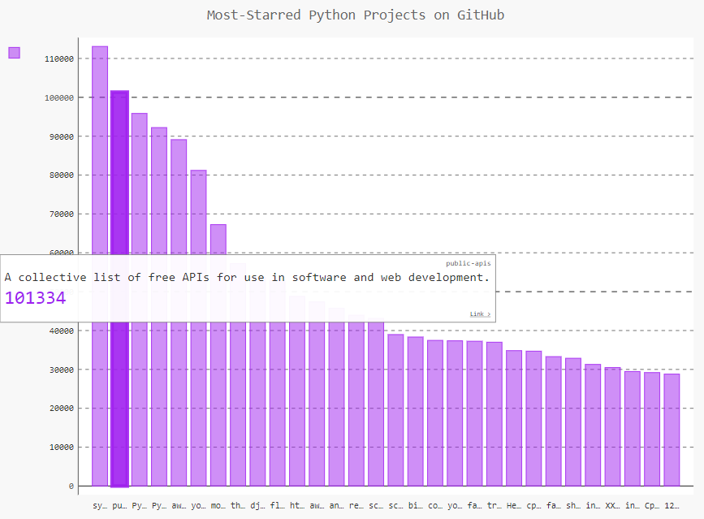

Data Analysis - Summary of GitHub Top Repositories
======

This project use a web application programming interface (API) to automatically request specific information from GitHub and then use that information to generate an interactive visualization of the relative popularity of these projects using PyGal.
------
  
  

This project is the result of the tasks performed during the study of Python Crash Course by Eric Matthes.

Book: [Python Crash Course, Second Edition](http://www.nostarch.com/pythoncrashcourse/)  
Author: [Eric Matthes](https://ehmatthes.github.io/pcc_2e/)

## Getting started

To run the project, you will need to install the following software:

- [Python 3.9.*: Required to run the Python project](https://www.python.org/ftp/python/3.9.2/python-3.9.2-amd64.exe)
- [Pygal 2.*: A Python API that enables us to build scalar vector graphic (SVG) graphs and charts in a variety of styles.](https://pypi.org/project/pygame/)
- [Requests 2.*: A HTTP library that allows you to send HTTP/1.1 requests extremely easily](https://pypi.org/project/requests/)

## Authors

Marcos Garcia   
e-mail: mvrgarcia05@gmail.com
